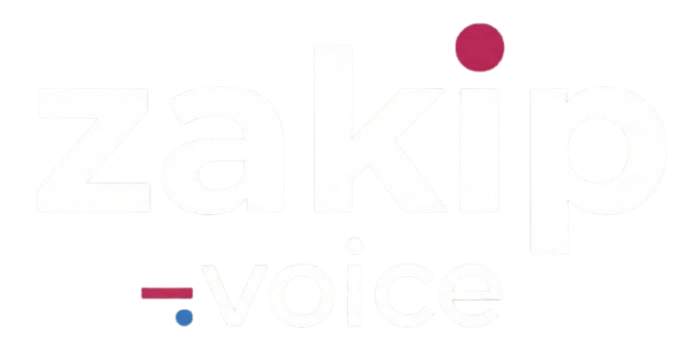

<p align="center">
  
</p>

<h1 align="center">Zakip Voice</h1>

<p align="center"><strong>Open-source desktop voice transcription with AI enhancement.</strong></p>

Record audio from your microphone, transcribe it through OpenAI-compatible APIs, optionally enhance the text with an LLM, and get the result copied to your clipboard — all with a single keyboard shortcut.

Built with [Tauri 2.0](https://tauri.app/) (Rust + React + TypeScript). Cross-platform: Windows, macOS, Linux.

---

## Features

- **One-shortcut workflow** — Press a global hotkey, speak, release. Text lands in your clipboard (and optionally auto-pastes into the active app).
- **OpenAI-compatible transcription** — Works with any Whisper-compatible API: OpenAI, Groq, OpenRouter, or your own self-hosted endpoint.
- **AI text enhancement** — Optionally polish transcribed text with an LLM (grammar correction, formatting, summarization). Fully configurable prompt.
- **Multiple provider support** — Built-in templates for OpenAI, Perplexity, Groq, OpenRouter, and any custom OpenAI-compatible API.
- **Privacy-first** — API keys are encrypted locally (AES-GCM). No telemetry. No cloud backend. All data stays on your machine.
- **Native audio recording** — Uses `cpal` for low-latency system microphone capture. WAV output.
- **Auto-paste** — Simulates Ctrl+V / Cmd+V to paste transcription directly into the focused application.
- **Transcription history** — Browse, search, and copy past transcriptions. View both raw and enhanced versions.
- **System tray** — Runs in the background with a tray icon. Hide-on-close behavior.
- **Sound notifications** — Audible feedback on recording start, stop, and clipboard copy.
- **Customizable shortcuts** — Configure global keyboard shortcuts for recording with or without AI enhancement.

## How It Works

```
┌──────────────┐    ┌──────────────┐    ┌──────────────────┐    ┌───────────┐
│  Microphone   │───>│  Rust Audio   │───>│  Whisper API      │───>│ Clipboard │
│  (cpal)       │    │  Recorder     │    │  (Transcription)  │    │ + Paste   │
└──────────────┘    └──────────────┘    └──────────────────┘    └───────────┘
                                               │
                                               v (optional)
                                        ┌──────────────────┐
                                        │  LLM Enhancement  │
                                        │  (gpt-4o-mini,    │
                                        │   custom model)   │
                                        └──────────────────┘
```

1. Press a global shortcut (e.g. `CmdOrCtrl+Shift+H`)
2. A small recording popup appears at the bottom of your screen
3. Speak — audio is captured natively via the Rust backend
4. Press the shortcut again (or `Escape` to cancel)
5. Audio is sent to your configured Whisper-compatible API for transcription
6. (Optional) Transcribed text is enhanced by an LLM with your custom prompt
7. Final text is copied to clipboard and optionally auto-pasted

## Installation

### Download Pre-built Binaries

Download the latest release for your platform from the [Releases](https://github.com/lukasz-gorka/zakip-voice/releases) page:

| Platform | Format |
|----------|--------|
| **macOS** | `.dmg` |
| **Windows** | `.msi`, `.exe` |
| **Linux** | `.AppImage`, `.deb`, `.rpm` |

### Build from Source

#### Prerequisites

- [Node.js](https://nodejs.org/) v20+
- [Rust](https://www.rust-lang.org/tools/install) (stable)
- [pnpm](https://pnpm.io/installation)
- Platform-specific dependencies:

**macOS:**
```bash
xcode-select --install
```

**Linux (Debian/Ubuntu):**
```bash
sudo apt install libwebkit2gtk-4.1-dev libgtk-3-dev libappindicator3-dev librsvg2-dev libasound2-dev
```

**Windows:**
- Microsoft Visual Studio C++ Build Tools 2022 with Windows 10 SDK
- WebView2 Runtime (pre-installed on Windows 10 v1803+ and Windows 11)

#### Build Steps

```bash
git clone https://github.com/lukasz-gorka/zakip-voice.git
cd zakip-voice
pnpm install
pnpm tauri build
```

Built artifacts will be in `src-tauri/target/release/bundle/`.

#### Development

```bash
pnpm install          # Install frontend dependencies
pnpm tauri dev        # Full app with hot-reload (frontend + Rust backend)
```

## Configuration

### Providers

On first launch, go to **Settings** and add at least one AI provider:

1. Click **Add Provider**
2. Choose a template (OpenAI, Groq, Perplexity, OpenRouter) or select **Custom**
3. Enter your API key
4. (Optional) Override the base URL for self-hosted endpoints

All providers use the OpenAI-compatible API format. Your API keys are encrypted locally using AES-GCM — they are never sent anywhere except to the configured API endpoint.

### Speech-to-Text Settings

- **Transcription model** — Select the Whisper model and provider to use (e.g. `openai::whisper-1`)
- **Language** — Set the audio language hint (default: `pl-PL`)
- **Global shortcuts:**
  - `CmdOrCtrl+Shift+H` — Record and transcribe (without AI enhancement)
  - `CmdOrCtrl+Shift+J` — Record, transcribe, and enhance with AI
- **Copy to clipboard** — Automatically copy result to clipboard
- **Auto-paste** — Simulate Ctrl+V / Cmd+V after copying
- **Sound notifications** — Audible feedback on recording events

### AI Enhancement

When enabled, the raw transcription is sent to an LLM for post-processing. You can customize the enhancement prompt using the `{{{MESSAGE}}}` placeholder:

```
Fix grammar and punctuation in the following text, keeping the original meaning:

{{{MESSAGE}}}
```

Enhancement requires configuring a provider and model in the UI. Any text completion model from your configured providers can be used.

## Architecture

### Two-layer design: React frontend + Rust backend

```
zakip-voice/
├── src/                          # React frontend (TypeScript)
│   ├── appInitializer/           # App boot sequence, G singleton, global store
│   ├── integrations/ai/          # AI abstraction layer (AIService, AIServiceBackend)
│   ├── voice/                    # Core voice workflow (VoiceModule)
│   ├── rustProxy/                # TypeScript wrapper for Rust invoke() calls
│   ├── autoUpdate/               # Auto-update functionality
│   ├── sound/                    # Sound notifications
│   ├── logger/                   # Logging system
│   ├── views/
│   │   ├── pages/                # VoiceHome, History, Settings
│   │   ├── settings/             # Provider, STT, Enhancement settings
│   │   └── ui/                   # shadcn/ui components (Radix UI primitives)
│   └── globalShortcuts/          # Keyboard shortcut registration
├── src-tauri/                    # Rust backend
│   └── src/
│       ├── main.rs               # Tauri setup, tray icon, window management
│       ├── commands.rs           # All #[tauri::command] handlers
│       ├── ai/
│       │   ├── proxy.rs          # AI request orchestrator
│       │   ├── provider.rs       # AIProvider trait
│       │   └── providers/
│       │       └── openai.rs     # OpenAI-compatible provider implementation
│       ├── audio/
│       │   └── recorder.rs       # Native audio recording (cpal + hound)
│       └── secure_storage.rs     # AES-GCM encrypted credential storage
├── .github/workflows/            # CI/CD (quality checks + platform builds)
└── scripts/                      # Build and release automation
```

### Frontend

- **React 19** + **TypeScript** + **Vite** — Modern SPA with fast HMR
- **Tailwind CSS 4** — Utility-first styling with custom theme
- **Radix UI** (shadcn/ui pattern) — Accessible, headless UI primitives
- **Zustand** — Lightweight state management with sections: `provider`, `voice`, `view`, `globalShortcuts`
- **React Hook Form + Zod** — Type-safe form validation
- **React Router v6** — Client-side routing (voice home `/`, settings)

### Backend (Rust)

- **Tauri 2.0** — Secure IPC bridge between frontend and native code
- **cpal** — Cross-platform audio capture (system microphone)
- **hound** — WAV file encoding
- **reqwest** — HTTP client with streaming support for AI APIs
- **enigo** — Cross-platform keyboard simulation (auto-paste)
- **AES-GCM** — Authenticated encryption for API key storage
- **tokio** — Async runtime with timeout and cancellation support (`tokio::select!`)

### Communication Pattern

```
Frontend (React)
    │
    ├── invoke("command_name", {args})  ──>  #[tauri::command] (Rust)
    │                                              │
    │                                              ├── External API call
    │                                              │
    │   <── Result / Error  ──────────────────────┘
    │
    └── listen("stream-chunk-{sessionId}")  <──  emit() (Rust, for streaming)
```

All AI operations pass credentials per-request — API keys are never stored in Rust state.

### Multi-Window Architecture

Two Tauri windows:

1. **main** — Primary app window (hidden on close, shown from tray)
2. **voice-recording-popup** — Small overlay during active recording

Windows communicate via Tauri events (`emitTo`/`listen`).

## Development

### Commands

```bash
# Frontend + Backend
pnpm tauri dev              # Full app with hot-reload
pnpm dev                    # Frontend-only Vite dev server (port 1420)
pnpm build                  # Build frontend (tsc + vite build)
pnpm tauri build            # Production build (platform-specific bundles)

# Code Quality
pnpm lint                   # ESLint
pnpm lint:fix               # ESLint with auto-fix
pnpm format                 # Prettier (write)
pnpm format:check           # Prettier (check)
pnpm typecheck              # TypeScript type checking (tsc --noEmit)
pnpm quality                # All three: format:check + lint + typecheck

# Rust Backend
cd src-tauri && cargo build     # Build Rust backend
cd src-tauri && cargo test      # Run Rust tests
cd src-tauri && cargo clippy    # Lint Rust code
```

### Code Style

- **Prettier:** 4-space indent, double quotes, 180 char line width, trailing commas, LF endings
- **TypeScript:** Strict mode, path alias `@/` → `src/`
- **Rust:** Standard `rustfmt` + Clippy with `-D warnings`

### CI/CD

GitHub Actions workflows:

| Workflow | Trigger | What it does |
|----------|---------|--------------|
| `code-quality.yml` | Push / PR | Prettier, ESLint, TypeScript, `cargo check`, Clippy |
| `build-macos.yml` | Release | Builds `.dmg` installer |
| `build-windows.yml` | Release | Builds `.msi` / `.exe` installer |
| `build-linux.yml` | Release | Builds `.AppImage`, `.deb`, `.rpm` |
| `deploy-release.yml` | Release | Deploys artifacts to server via SSH |

### Cross-Platform Building

```bash
# macOS
pnpm tauri build --target x86_64-apple-darwin      # Intel
pnpm tauri build --target aarch64-apple-darwin     # Apple Silicon

# Windows (from Windows)
pnpm tauri build --target x86_64-pc-windows-msvc

# Linux
pnpm tauri build --target x86_64-unknown-linux-gnu
```

## Tech Stack

| Layer | Technology | Purpose |
|-------|-----------|---------|
| Frontend | React 19, TypeScript, Vite | UI and application logic |
| Styling | Tailwind CSS 4, Radix UI | Component design system |
| State | Zustand | Global state management |
| Backend | Rust, Tauri 2.0 | Native capabilities, IPC |
| Audio | cpal, hound | Microphone capture, WAV encoding |
| AI | reqwest, OpenAI-compatible API | Transcription and enhancement |
| Security | AES-GCM, SHA-256 | Credential encryption |
| Keyboard | enigo | Auto-paste simulation |
| CI/CD | GitHub Actions | Quality checks, platform builds |

## Troubleshooting

### macOS: Accessibility Permissions

Auto-paste requires accessibility permissions. When prompted, grant permission in **System Preferences > Privacy & Security > Accessibility**.

If the app is unsigned, you may need to:
```bash
xattr -cr /Applications/zakip-voice.app
```
Then right-click the app and select **Open**.

### Linux: Wayland Issues

If you encounter `Could not create default EGL display: EGL_BAD_PARAMETER`:
```bash
WEBKIT_DISABLE_COMPOSITING_MODE=1 ./zakip-voice.AppImage
```

For auto-paste on Wayland, you may need `wtype` or `dotool` installed.

### Linux: Audio Dependencies

Ensure ALSA development libraries are installed:
```bash
# Debian/Ubuntu
sudo apt install libasound2-dev

# Fedora
sudo dnf install alsa-lib-devel
```

### Windows: SmartScreen Warning

Unsigned builds trigger SmartScreen. Click **More info** then **Run anyway**. Signed builds will show a normal publisher prompt.

### Build Issues

```bash
# Clean and rebuild
pnpm install
cd src-tauri && cargo clean
pnpm tauri build

# Verify toolchain
rustup update
cargo tauri --version
```

## Contributing

Contributions are welcome. Please:

1. Fork the repository
2. Create a feature branch (`git checkout -b feature/my-feature`)
3. Run quality checks before committing:
   ```bash
   pnpm quality
   cd src-tauri && cargo clippy -- -D warnings
   ```
4. Commit with a clear message
5. Open a pull request

## License

[MIT](LICENSE) — Copyright (c) 2025 Łukasz Górka

Free to use, modify, and distribute. See the [LICENSE](LICENSE) file for details.
